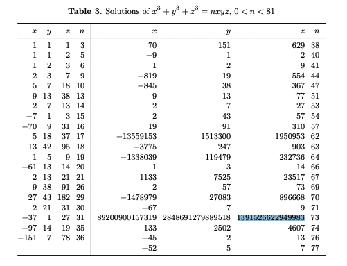

# Derik

## 要約

## 考察

`x^e + y^e + z^e == d*x*y*z` という形。
eはあまり大きくできないと予想。

`a*e - b*d == c` という式により、(e,d)が縛られている。
ありうるものを小さい順に列挙すると、
(e,d) = (3,73), (43,105503), (67,168761), ...
となる。
(e,d) = (3,73) であろうと考える。

`c = pow(m, 65537, n)` の大きさは 1542 bit。
ということは、nの大きさもそれくらいと予想。
p,q,rが同じくらいの大きさだとすれば、512bitずつくらい。
C[0:6]あたりがまさにそのサイズ感。

C[0:6]たちは、全て合成数。
互いに大きな公約数を持っていたりはしない。

O[0:3]あたりを使っていないので、適当にネットを検索。
こんなのを発見した。
<http://matwbn.icm.edu.pl/ksiazki/aa/aa73/aa7331.pdf>

あとは、x,y,zがそれぞれどれに対応するかを全探索する。
連立方程式を解けばよい。

## 解法

## 別解
